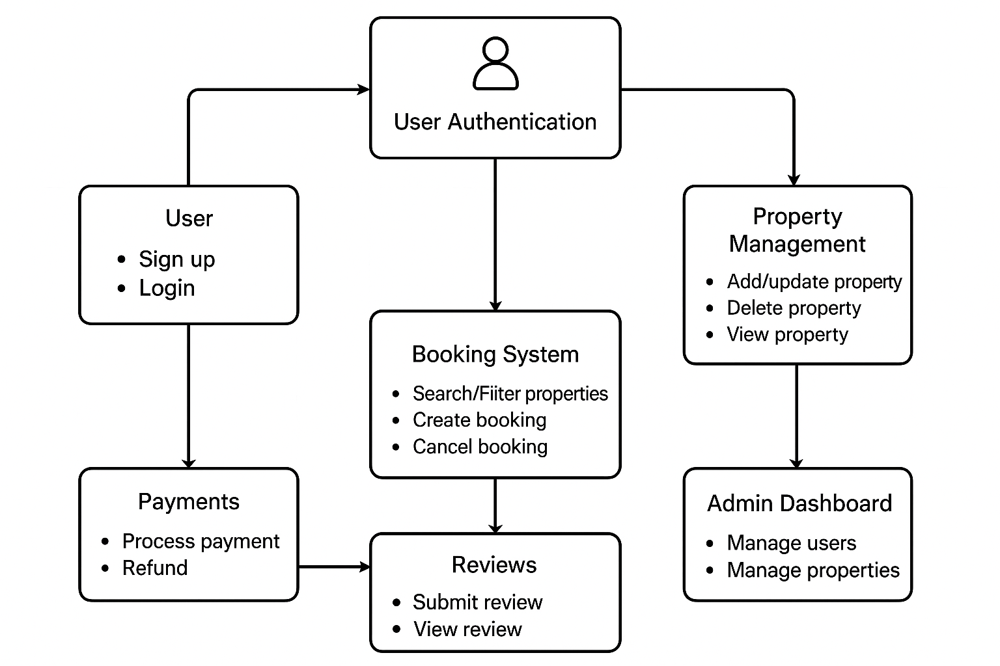

# Airbnb Clone Backend Architecture

## Overview

This document presents the backend architecture for the Airbnb Clone project, created using Draw.io (diagrams.net).
It visually outlines all major backend components and their relationships, helping developers understand system functionality, data flow, and integration points

## Contents

The diagram covers:

1. **User Authentication & Authorization**
- User registration and login using JWT.
- Role-based access control (Guest, Host, Admin).

2. **Property Management**
- Host property creation, editing, and deletion.
- Property listings with descriptions, pricing, and availability.

3. **Booking System**
- Booking creation, updates, and cancellation.
- Validation to prevent overlapping bookings.

4. **Payment Processing**
- Secure payments via Stripe/PayPal integration.
- Linking payments to confirmed bookings.

5. **Reviews & Ratings**
- Guests submit reviews after completed bookings.
- Hosts can respond to reviews.

6. **Notifications**
- Email and in-app notifications for key events (booking confirmations, cancellations, etc.).

7. **Admin Dashboard**
- Monitoring and managing users, listings, and transactions

## File

## Usage

1. Open the PNG file to view the architecture overview.
2. Use it as a reference when building API routes, database models, and business logic.