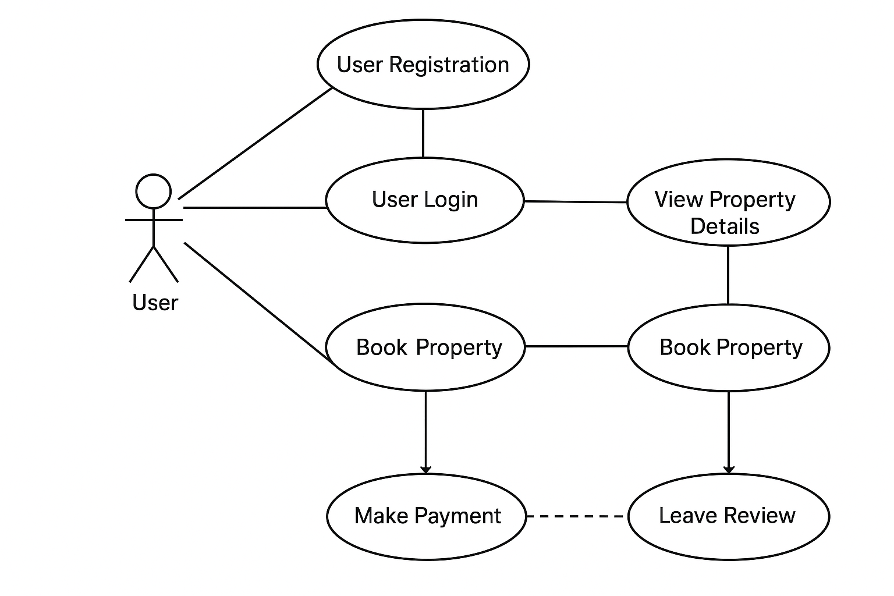

# Airbnb Clone Use Case Diagram

## Overview

This diagram visualizes how users interact with the Airbnb Clone backend system.
It identifies the main actors and their interactions with core system features, helping developers understand user flows and backend responsibilities

## Key Actors

- User (Guest or Host) — main system actor interacting with the platform.
- (Optionally extendable to Admin) for management operations

## Core Use Cases

1. **User Registration** - Create a new account as guest or host
2. **User Login** - Authenticate using email and password
3. **View Property Details** - Browse property information
4. **Book Property** - Reserve an available listing
5. **Make Payment** - Complete a booking via supported payment gateway
6. **Leave Review** - Submit feedback after a completed booking

## File

## Usage

Open the PNG file to understand system interactions before implementing API endpoints and backend logic